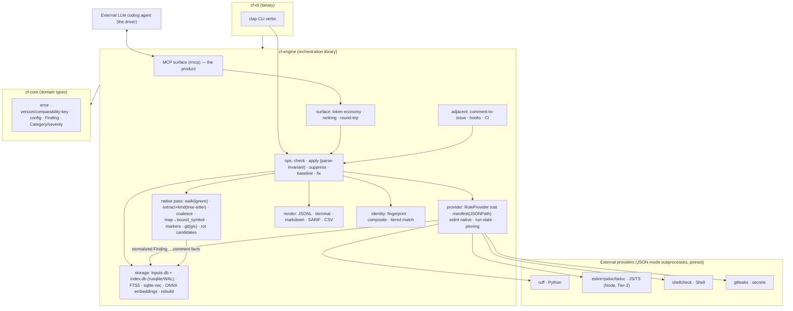

# Codebase Context

## Detected Stack
**Greenfield Rust project.** The repository at plan time contains only `Docs/Idea.md` (the 1056-line design spec), `LICENSE`, `.gitignore` (ignoring `.claude/` + `.DS_Store`), and the `.claude/` working dir — there is **no `Cargo.toml` and no source code**. The Rust toolchain is present (rustc/cargo 1.96.0). The Idea specifies the entire stack (§10): a native-Rust hot path (`tree-sitter` + four grammars · `ignore` · `rayon` · `rusqlite` with bundled SQLite + FTS5 + `sqlite-vec` · `fastembed-rs`/`ort` ONNX · `gix`), the agent surface via `rmcp`, the CLI via `clap`, and an RFC 9535 JSONPath library for manifests. The only non-Rust runtime is the **eslint Node stack**, deliberately isolated as the lone Tier-2 native provider and fetched only when JS/TS is in scope. No Rust-specific rule file exists in the user's rule directories — `general.md` (language-agnostic) governs, with `python.md` applying only to Python test fixtures.

## Patterns to Follow
- **Three-crate workspace:** `cf-core` (pure substrate types: error, version, config, finding, identity) · `cf-engine` (orchestration: walk, extract, map, git, storage, provider, ops, render, mcp, surface, ci, issues, hooks) · `cf-cli` (the `cf` binary). MCP and CLI share the engine library so verbs stay 1:1.
- **Sole-writer storage:** the engine is the only SQLite writer; WAL mode; two-layer cache (content-addressed `inputs.db` survives schema bumps, derived `index.db` rebuilds), gitignored at `<repo_root>/.comment-finder/`.
- **Delegate, don't reimplement:** rule content comes from ruff/eslint/shellcheck/gitleaks via `RuleProvider` adapters; built-ins ship as manifests (dogfooding); `cf` only spawns JSON-mode subprocesses and normalizes.
- **Layer discipline:** `cf-core` (domain) imports no infrastructure; subprocess/SQLite/git errors translate to `CfError` at the `cf-engine` adapter boundary.
- **Determinism + safe-write are the two promises** — every design choice (content-hash keys, canonical ordering, parse-invariance, rebuild-over-migrate) exists to uphold them, and they are property-tested, not asserted.

## Reusable Components
This is greenfield, so there is no prior CF code to reuse; the "reusable" assets are the **authoritative design spec** (`Docs/Idea.md`, cited section-by-section in every task) and the **named third-party crates** the design selects (do not hand-roll their concerns): `ignore` for the walk, the four tree-sitter grammars for extraction *and* the parse-invariance re-parse, `rusqlite`'s bundled SQLite for storage + FTS5 + the sqlite-vec host, `gix` for git, `rmcp` for the MCP surface, and `clap` for the CLI. Within the build, later phases reuse earlier substrate heavily: the parse-invariant applier (7.2) reuses the tree-sitter extraction (2.2); identity Tier-4 (5.3) and hybrid search (4.7) reuse the embeddings (4.5); the round-trip (8.5) reuses `check` (7.1) + the applier (7.2).

## Relevant Rules
The language-agnostic **`general.md`** catalog applies in full to the Rust engine (cited per-area in the frontmatter `relevant_rules` `focus`): cause-chained context-rich errors (`ERR_*`), no swallowed errors, no hardcoded secrets / no secrets in logs (gitleaks *finds* secrets, CF never *stores* them; tracker auth uses host credentials), provider subprocesses spawned with argument arrays never a shell (`SEC_COMMAND_INJECTION`), bounded worker/subprocess pools with memory O(workers) (`PERF_UNBOUNDED_COLLECTION`), RAII cleanup for connections + subprocesses (`RES_LEAK`), domain/infra layer separation (`ARCH_LAYER_VIOLATION`), all thresholds (τ≈0.8, severity tables, ranking weights, timeouts) as named constants (`ORG_MAGIC_NUMBER`), single-writer + WAL for the cache (`CONC_RACE`), and independently-versioned contracts with MCP stability tiers (`API_BREAKING_CHANGE`). The user's global **`~/.claude-work/CLAUDE.md`** mandates long-term-excellence (no hacky/temporary fixes, best-approach-only options, zero tolerance for bugs including pre-existing ones) and **forbids `Co-Authored-By` lines in commits**. Cite rule IDs (path only; full text not pasted).

## Architecture Diagram

