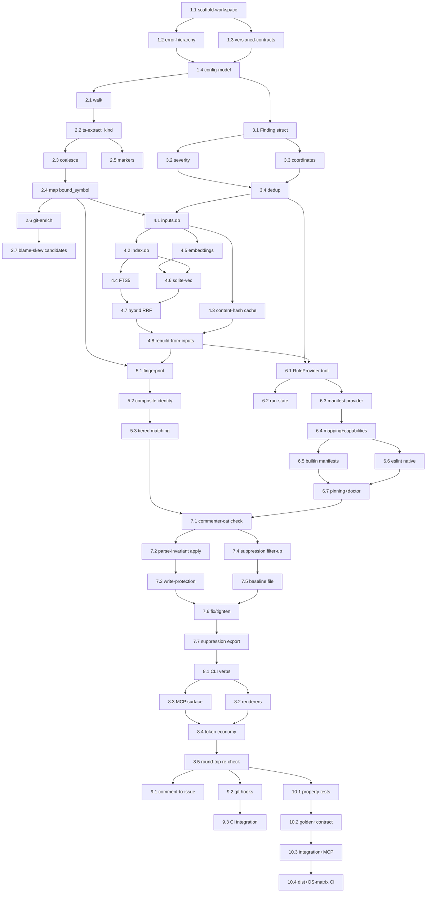

# Execution Graph

## Dependency DAG

## Critical Path
The longest dependency chain (28 tasks) threads the deepest serial work across every phase. Each step gates the next:

1. **1.1 → 1.2 → 1.4** — the workspace, then errors, then config gate all engine code.
2. **2.2 → 2.4 → 2.6** — extraction → mapping → git enrichment are strictly serial (each consumes the prior).
3. **4.2 → 4.4 → 4.7 → 4.8** — index schema → FTS5 → hybrid retrieval → rebuild; storage is the serial spine of the index.
4. **6.1 → 6.3 → 6.4 → 6.5 → 6.7** — provider trait → manifest → mapping → built-ins → pinning/doctor.
5. **7.1 → 7.2 → 7.3 → 7.6 → 7.7** — check → applier → write-protection → fix → export, all on the safe-write spine.
6. **8.1 → 8.3 → 8.4 → 8.5** — CLI verbs → MCP surface → token economy → round-trip (the product's loop).
7. **10.1 → 10.2 → 10.3 → 10.4** — property → golden/contract → integration/MCP → distribution; the proof-and-ship tail.

(Phase 5 identity feeds 7.1 but is shorter than the Phase-6 chain into 7.1, so it is not on the critical path. The cross-phase gates 4.2/4.4/4.7/4.8 and 6.x dominate the storage→provider→ops spine.)

## Parallel Groups
Front-loaded, wide-and-shallow where possible (see frontmatter `parallel_groups`):

- **After 1.1:** 1.2 and 1.3 run together (error hierarchy vs. version constants — different files).
- **After Phase 1:** **Phase 2 (native substrate) and Phase 3 (finding model) run fully in parallel** — the largest parallelization win; one lives in `commenter-cat-engine`, the other in `commenter-cat-core`.
- **Within Phase 2:** after 2.2, the marker extractor (2.5) runs alongside the coalesce→map chain (2.3→2.4).
- **Within Phase 4:** after 4.1, the index schema (4.2), content-hash cache (4.3), and embeddings (4.5) proceed in parallel before converging at 4.6/4.7.
- **After Phase 4:** **Phase 5 (identity) and Phase 6 (providers) run in parallel.**
- **Within Phase 6:** after 6.4, the dogfooded built-in manifests (6.5) and the eslint native provider (6.6) run in parallel before converging at 6.7.
- **Within Phase 7:** after 7.1, the applier chain (7.2→7.3) and the suppression chain (7.4→7.5) run in parallel before converging at 7.6.
- **Within Phase 8:** after 8.1, the renderers (8.2) and the MCP surface (8.3) run in parallel before converging at 8.4.
- **After Phase 8:** **Phase 9 (adjacent integrations) and Phase 10 (distribution + tests) run in parallel** — 9.1, 9.2, and 10.1 can all start at once.

## Atomic-Claim Protocol (embedded copy)

For parallel orchestration:

1. Worker reads `STATUS.md`.
2. Worker confirms task state is `ready` (all `depends_on` are `done`).
3. Worker writes `STATUS.md` with `state: claimed`, `worker_id`, `claimed_at`.
4. Worker re-reads `STATUS.md` immediately.
5. If `worker_id` matches own — claim succeeded; advance to `in_progress`.
6. If `worker_id` differs — claim lost; pick another `ready` task.

Best-effort coordination; markdown has no hard locking. For higher safety, route claims through a single orchestrator (workers dispatched via the `Task` tool never self-claim).

## Re-plan Triggers
Trigger a re-plan (edit phase files in a mutable state, reset to `queued`, append a `CHANGELOG.md` entry, re-run Step 5 self-validation) when:

- Any task enters `failed` and a retry needs a changed spec.
- An open question (Q1–Q4) resolves in a way that changes a task's `action`/`files`/`validation` (e.g., the chosen JSONPath library or embedding model forces a structural change).
- A discovered blocker (e.g., a Rust crate from §10 is unavailable or incompatible at MSRV 1.96) requires re-routing a dependency.
- A scope change request arrives (note: the Idea forbids scope reduction by phasing — additions land as new tasks, not as deferrals).
