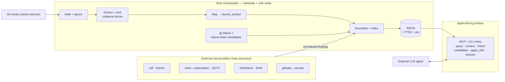
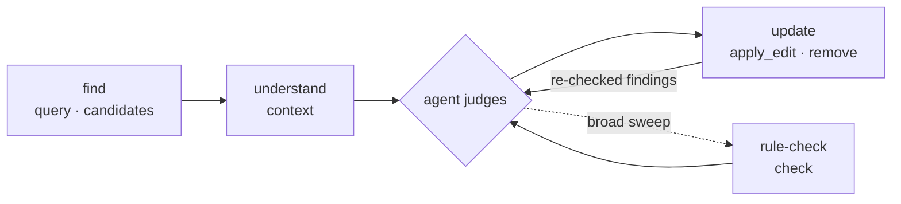

# Commenter-Cat — Design Decisions

> **Status:** Design / pre-implementation
> **Last updated:** 2026-06-15
> **Source:** Brainstorm session decisions, consolidated.

A deterministic, multi-language **comment-intelligence layer** — a Rust orchestrator. It
walks a directory, extracts comments (tree-sitter), **maps each comment to the code it
annotates**, **delegates per-language rule-checking to best-in-class external tools**
(ruff, eslint + jsdoc/tsdoc, shellcheck, gitleaks), **normalizes** their findings into one
unified model, enriches with git, indexes everything in a per-project SQLite cache
(keyword + vector search), and exposes the whole thing as an **agent-facing surface**
(MCP tools = CLI verbs) — and **that agent-facing surface, driven live, is the product** (§4a);
everything else is substrate that serves it.

**No LLM, and no reinvented linters, in its own flow.** The engine hosts neither a model
nor a from-scratch rule-checker. It **unifies, maps, indexes, and exposes** — specialized
tools bring the per-language rule *content*; the consuming LLM agent brings the *judgment*.

---

## 0. Build principle

**Full implementation. No MVP, no phased rollout, no v0.x/v1/beta.** Every capability in
this document is in scope and built as one complete system. Phasing language is
intentionally absent — decisions are made for the whole, with long-term architectural
soundness as the only constraint, not effort or timing.

---

## 1. Purpose (the reframe)

**The product is the live-session agent loop** (§4a). A coding agent — Claude Code and peers —
reaches for `commenter-cat` mid-task to **find** comments across four languages → **understand** the code
each annotates → **rule-check** them under one normalized model → **update** them without
breaking code, then re-check. `commenter-cat` is the tool; the agent is the driver; the loop is the
deliverable. Every other section exists to make that loop fast (§6–§7), accurate (§5), and
safe (§5 applier).

"Find comments" is the **mechanism**, not the goal. The split that organizes the *substrate*
beneath that loop:

> **The engine owns the drift it can _prove_. The consuming LLM owns the drift it must
> _judge_. The comment→code mapping is the handoff between them.**
>
> And: **proven rules come from mature, published tools — not from us.** We orchestrate
> and unify; we do not reimplement.

| Job | Mechanism | Owner |
|---|---|---|
| **Tech-debt tracking** | TODO/FIXME/HACK markers, aged via git blame | Engine (extract) + provider (format) |
| **Cleanup** | Commented-out *code* vs. prose | Provider (`ruff ERA`, eslint) |
| **Security audit** | Secrets / creds in comments | Provider (`gitleaks`) |
| **Doc coverage** | Docstring / JSDoc presence | Provider (`ruff D1xx`, `eslint require-jsdoc`) |
| **Doc-signature drift** | Documented params vs. actual signature | Provider (`ruff D417`, `jsdoc/check-param-names`) — **unified + mapped by us** |
| **Comment hygiene / style** | Marker form, owner/date, width, spacing | Provider (ruff/eslint/shellcheck) |
| **Semantic rot** | Comment's *meaning* vs. code's *behavior* | **Agent** — engine supplies evidence + candidates + safe apply |

**Differentiator.** Linter unification alone is not new — trunk.io, megalinter, and reviewdog
already aggregate tools under one config. What none of them expose is an **agent-drivable
surface in a live session**: comment→code mapping, git-aware rot candidates, and a
parse-invariant safe-write path, all over one index with one suppression model, reachable as
MCP verbs an agent calls mid-task. The per-language providers are best-in-class at *their*
language and blind to the other three; they don't map comments to code, don't track
blame-skew, don't expose an agent API, and each has its own output and disable syntax. **We
unify them and hand the result to the agent.**

---

## 2. Architecture

**A Rust orchestrator (the _engine_) — not a single self-contained binary.** It owns the
*substrate* (extract · map · enrich · normalize · index · search · surface) and **delegates
rule content** to external providers. Dependencies on those providers are accepted in
exchange for their accuracy; max-accuracy is the explicit priority over zero-setup.



### Why Rust orchestrates, and why it delegates

- **Delegate rule content** — ruff, eslint(+jsdoc/tsdoc), shellcheck, gitleaks are mature,
  precise, and maintained. Reimplementing them natively would be a *worse, perpetually
  lagging clone* and a duplicated source of truth (the same trap as a committed index).
  "No need to discover America from scratch."
- **Own the substrate in Rust** — the hot path (walk, tree-sitter extract, map, normalize,
  index, embed) wants ripgrep-class speed and a tight orchestration loop. This is the part
  no existing tool does, and the part that benefits from native performance.
- **The engine is to linters what it is to LLMs:** it hosts neither. It unifies the output
  of specialists and exposes a single queryable, mappable, agent-drivable surface.

### What this trades away (recorded so it isn't re-litigated)

- **"Single binary, zero runtime"** — *dropped.* `commenter-cat` declares external provider
  dependencies and degrades gracefully when one is absent (§5). Accuracy was chosen over
  self-containment.
- Still **single-language for the substrate** (Rust): no Python skill layer, no
  cross-language DB writer war, deterministic cache keys.

---

## 3. Engine (Rust) — the substrate

The engine does everything *except* decide rules. Rule detection is delegated (§5); what
remains here is uniquely ours.

- **Extraction: tree-sitter, not regex.** Exposes a `comment` node per grammar — zero
  string-vs-comment false positives. (We still extract natively even though providers also
  parse, because the providers don't yield a *unified, mapped* comment record.)
- **Committed language set:** Python, TypeScript, JavaScript, Shell. (`.env.*` + secrets →
  the gitleaks provider, §5.) More grammars are low-cost tree-sitter additions, out of
  defined scope.
- **File walking + ignore: the `ignore` crate** (powers ripgrep). Respects
  `.gitignore` / `.ignore`; opt-out flag available. Plus a **generated-file heuristic**
  (header sniff) so minified/generated pseudo-comments don't pollute results.
- **Comment kind classification (first-class):** `line` · `block` · `docstring` ·
  `shebang` · `license` · `encoding-decl` · `directive` (`commenter-cat:*` control comments).
  `shebang` + `license` are **default-suppressed**; `directive` comments are control-only,
  never finding targets (§5).
- **Block coalescing:** adjacent line-comment nodes merge into one logical block before
  mapping. Docstrings are already single nodes.
- **Comment→code mapping** (load-bearing for `context`, `candidates`, and for attaching
  provider findings to a symbol). **No scoring heuristic** — the binding the interesting
  rules need is fixed by each language's own standard, so three deterministic rules suffice:
  - **Doc comment** → bind by the **language standard**: PEP 257 (docstring = first
    statement in the `def`/`class`/module body) for Python; JSDoc/TSDoc adjacency
    (`/** */` immediately precedes the symbol) for TS/JS.
  - **Trailing comment** → a code node on the **same line** → annotates that statement.
  - **Lead comment** → own line, statement on the next line with **no blank line between**
    → binds down to that sibling (`bound_node_range`).
  - **Orphan** → none of the above → no node binding; `bound_symbol` = enclosing scope.

  Residual rule: **blank-line adjacency**. Non-doc comments never need precise node-binding
  — enclosing scope + line geometry is enough.
- **Marker extraction (native):** TODO, FIXME, HACK, XXX, BUG, NOTE, DEPRECATED, WARNING,
  REVIEW + custom. We extract and index markers ourselves (they feed triage, search, and
  blame-skew); the *format* check (`# TODO(owner):`, `ruff TD002/003`) is the provider's.
- **Git enrichment:** blame join → author, date, commit per comment.
- **Blame-skew rot *candidates* (native, unique):** flag a comment whose blame date
  **predates its bound code's** blame date — code changed after the comment was written. A
  **token-free shortlist** the engine hands an external agent to *judge*. No provider does
  this; it needs our mapping + git join.
- **Silent-rot detectors (native, unique; see `rot/` and `CLAUDE.md`):** the blame-skew
  candidate generalizes to five deterministic, agent-judged detectors that catch a comment which
  *reads like good documentation while making a factual claim about its bound code that is no
  longer true* — reference-liveness (`rot_ref`), docstring↔signature contract (`rot_signature`),
  path/identifier existence (`rot_path`), git-drift (`rot_drift`, this candidate with an age
  threshold), and embedding-gated semantic contradiction (`rot_semantic`). A comment-intent
  classifier gates them to checkable claims (and quiets the `NOTE`/`WARNING` log-level false
  positives the dogfooding session flagged). Each reuses our binding + git + embeddings, emits
  `origin = native` / `fix = agent_only`, and proposes — the agent judges (§9). Configured via a
  `[rot]` section: the four structural detectors default on, semantic defaults off behind them.
- **The normalizer:** fuse every provider's findings (§5) + native facts into one record,
  attached to comments by location and `bound_symbol`.

---

## 4. Interfaces

Three interfaces: the agent surface is the product; JSONL is an output; SQLite is the
cache. JSONL and each SQLite layer (`inputs.db`, `index.db`, §6) carry a `schema_version`.

### Comment record (shape)

`repo-relative path · content/blob hash · stable-identity fingerprint · language · kind ·
line range · byte offsets · raw text · bound_symbol · bound_node_range · marker tags ·
(enriched) git author/date/commit · is_rot_candidate · **findings[]** (normalized, from
providers + native)`

Each entry in `findings[]` is a normalized **Finding** — `origin · provider_rule_id
(lossless) · canonical_rule_id · category · severity (canonical 4-level) · target (comment or
symbol) · range · fix` — produced by the provider adapters and the native checks, reconciled
to one schema (§5).

### Comment identity (cross-scan matching)

`content_hash` is the *cache* key (exact bytes) — too brittle to be *identity*. A one-word
edit must not orphan a suppression or re-file an issue. So identity is a **composite**:

```
identity = ( bound_symbol , kind , cosmetic_fingerprint )   # ordinal tie-breaks collisions
```

- **`cosmetic_fingerprint` = `hash(normalize(text))`**, where `normalize` = strip
  delimiter → **keep** the marker (a `TODO`→`FIXME` escalation is a real change) → collapse
  whitespace → lowercase → strip trailing punctuation. **Lexical only** — no stemming, no
  stopword removal.
- **`bound_symbol`** anchors location, so identity survives line shifts.

**Matching is tiered, precision _per use-case_:**

| Tier | Match | Stops here for |
|---|---|---|
| **1 — exact** | `content_hash` equal | cache hit |
| **2 — cosmetic** | same `(bound_symbol, fingerprint)` | **suppression, baseline** — a false match would hide a real finding |
| **3 — relocated** | same `fingerprint`, different `bound_symbol` | following a comment through a refactor |
| **4 — reworded** | same `(bound_symbol, kind)`, similarity ≥ τ (≈0.8), **no rival** | **issue / blame continuity only** — never suppression |

### 4a. Agent-facing surface (the product)

The engine is the deterministic substrate a coding agent drives **in a live session** —
**MCP tools, 1:1 with CLI verbs**. This is the section everything else serves; the rest of the
document is substrate that makes this loop fast, accurate, and safe.

**The loop the agent runs.** It reaches for `commenter-cat` mid-task and stays in one cycle without
leaving its session — find → understand → judge → update → re-check:



**Three verbs, six primitives.** The agent thinks in *find · update · rule-check*; the surface
organizes the six tools under them:

| Verb | Primitives | Returns / does |
|---|---|---|
| **find** | `query`, `candidates` | the comment set, filtered (marker / kind / rule / FTS / semantic), **ranked + paginated**; `candidates` = the blame-skew rot shortlist |
| **understand** | `context` | one comment + its mapped code window — the unit on which an agent judges semantic rot |
| **rule-check** | `check` | unified findings (all providers + native), normalized — one report across 4 languages |
| **update** | `apply_edit`, `remove` | comment-only write / deletion under the **safe-apply guarantee** (below); the engine lands the agent's text without it ever touching code |

**Token economy — the first-class constraint.** An agent has a finite context window; a repo
has tens of thousands of comments. So **no return is a firehose** — every result is ranked,
bounded, and drillable:

- **Summaries by default, detail on demand.** `query` / `check` return a ranked head (total
  count + top-N) with a `cursor`; the agent pulls `context` only for the comments it will act
  on. Bound code is **opt-in via `context`**, never bundled into `query` — tokens are spent
  only where the agent acts.
- **Budget-aware, never silently truncated.** A `limit` / `max_tokens` parameter caps the
  response; the surface returns the highest-priority slice that fits plus a `truncated` flag
  and a `cursor` to continue — a bounded view is always *labeled* as bounded.
- **Actionable-first ranking:** severity → blame-age → marker weight (or FTS / vector score
  for search), so page one is the work most worth doing.

**The round trip closes the loop.** `apply_edit` and `remove` **return the re-checked findings
for the touched comment / symbol**, so the agent sees its fix land — or sees a finding it just
introduced — without a separate `check` call. The find→update→re-check cycle is one tool-call
deep.

**Safe-apply — the pillar that lets an agent hold the write path.** Two guarantees, both
enforced by the engine, never trusted to the agent (§5):

1. **Parse-invariance** — after a comment-only edit, re-parse and assert the **code-node tree
   is byte-identical**; if any code node changed, **abort**.
2. **Write-protection by kind** — `directive` (`commenter-cat:*`, `# noqa`, `// eslint-disable`,
   `# type: ignore`, `// @ts-expect-error`), `shebang`, and `encoding-decl` comments are
   **parse-invariant yet behavior-bearing** — read by the type-checker, the orchestrated
   linters, or the OS, not the grammar. They are **not freely rewritable**: an edit requires an
   explicit `allow_significant` acknowledgment and is flagged as such.

**Division of labor — _AI proposes, engine guarantees._** The agent judges (via `context` +
`candidates`), authors the new comment text, and the engine applies it deterministically —
proving the code is byte-identical *and* that no behavior-bearing comment changed silently.

### 4b. JSONL output

Canonical machine-readable stream (`schema_version`-tagged). Render-and-pipe; not an IPC
boundary.

---

## 5. Operations — orchestrate, normalize, fix, suppress

The engine is a **conductor**, not an analyzer. `commenter-cat check` runs the providers, fuses their
output with native facts, and reports one unified result.

### `commenter-cat check` — orchestrated linting

1. **Run providers** (only on changed files; results cached, §6), each via a `RuleProvider`
   adapter.
2. **Normalize** every tool's output into `findings[]` (§4) — `ruff` JSON, `eslint` JSON,
   `shellcheck` JSON, `gitleaks` — reconciled to one schema with `origin` provenance.
3. **Add native findings** the tools can't: blame-skew candidates, cross-language marker
   triage (marker × severity × blame-age).
4. **Render** through §8 formats + CI exit codes.

### Providers (max-accuracy defaults)

| Language / job | Provider | Supplies |
|---|---|---|
| **Python** | **ruff** | `D1xx` doc presence, `D2xx–D4xx` docstring style, `ERA` commented-code, `TD` todo-format, `D417` drift |
| **JS / TS** | **eslint** + `eslint-plugin-jsdoc` (+ `eslint-plugin-tsdoc`) | `check-param-names` drift, `require-jsdoc`, `no-warning-comments`, style |
| **Shell** | **shellcheck** + Google-shell conventions | shebang, header blocks, directive grammar |
| **Secrets** | **gitleaks** | secrets/creds in comments and config |

- **Swappable** — an adapter, not a hard-wire. A lean profile (`oxlint` for JS/TS to avoid
  Node) is possible but **not** the design driver; accuracy is.
- **Graceful degradation** — `on_missing = warn`: a missing provider skips that language's
  deep rules (warned, non-fatal); native mapping / search / candidates still run.
- **Convention pass-through** — `docstring_convention = "google"` is handed to the provider
  (`ruff convention=google`), so we honor the team's existing standard, never fight it.

### Provider normalization — the unified finding

Every adapter maps its tool's output into one `Finding`, **filtered to the comment domain**
— we ingest a curated rule subset per tool (`ruff` `D`/`ERA`/`TD`, eslint `jsdoc/*` +
comment rules, shellcheck shebang/directive, gitleaks), never a tool's full code-lint output.

```
Finding {
  origin            : ruff | eslint | shellcheck | gitleaks | native
  provider_rule_id  : origin-qualified, LOSSLESS  # "ruff:D417" — never discarded
  canonical_rule_id : Commenter-Cat-vocabulary id            # "D417" (the adopted published id, §1)
  category          : cross-language concept       # coarse bucket (enum below)
  severity          : critical | error | warning | info     # canonical, resolved
  severity_native   : string?                      # the tool's original, kept for fidelity
  message           : string
  target            : comment_id | bound_symbol    # the comment, or the symbol that lacks one
  range             : { start_byte, end_byte, start_line, end_line }   # our coordinates
  fix               : provider_autofix | agent_only | none
  url               : string?                      # rule doc link
}
```

**Rule identity is never lossy.** `provider_rule_id` (`ruff:D417`) is the origin-qualified
original, always preserved; `canonical_rule_id` (`D417`) is that id adopted into Commenter-Cat's
vocabulary (§1); `category` is the coarse cross-language bucket — `doc_missing` · `doc_drift`
· `doc_style` · `commented_code` · `secret` · `todo_format` · `marker_stale` ·
`comment_style` · `shebang` · `directive` · `rot_candidate`. Filters, `explain`, and
suppression accept **any** level — `origin:ruff:D417`, `D417`, or `doc_drift` — so the agent
can stay coarse or drill to the exact rule.

**Severity is canonical, anchored on `category` for cross-language consistency.** Resolution
order, first hit wins:

1. **Config override** — `[severity] "ruff:D100" = "info"` or `doc_missing = "error"` (final say).
2. **Category canonical default** — the consistency anchor (table). Guarantees `doc_drift`
   is `error` whether `ruff` or `eslint` found it.
3. **Per-tool translation table** — the tool's native scale → canonical (fallback for
   categories with no canonical opinion). Always recorded as `severity_native`.

| category | canonical | CI |
|---|---|---|
| `secret` | **critical** | fail |
| `doc_drift` · `directive` (malformed) | **error** | fail |
| `commented_code` · `doc_missing` · `marker_stale` · `shebang` | **warning** | — |
| `doc_style` · `comment_style` · `todo_format` · `rot_candidate` | **info** | — |

| Tool | Native scale | → Canonical (fallback) |
|---|---|---|
| **eslint** | error (2) / warn (1) | error / warning |
| **shellcheck** | error / warning / info / style | error / warning / info / info |
| **ruff** | *(none — diagnostics only)* | by category |
| **gitleaks** | *(binary hit)* | critical (always) |
| **native** | *(none)* | by category |

**CI:** `fail_on = "error"` (default) — the build fails on any finding at or above this level.

**Coordinate + dedup hygiene:** each adapter maps the tool's coordinates to our byte-offset
system — 1-based vs 0-based, and **eslint reports UTF-16 columns** while tree-sitter/ruff are
byte/char, so reconcile per adapter. Two findings of the same `category` overlapping one
comment are **deduped**: highest severity kept, `origin`s unioned.

### `commenter-cat fix` / `commenter-cat tighten`

- **Provider autofixes** orchestrated (`ruff --fix`, `eslint --fix`) — each tool owns its
  own edit safety.
- **Native parse-invariant applier** for **agent-authored** comment edits (`apply_edit`):
  after any comment-only edit, **re-parse and assert the code-node tree is byte-identical**;
  if a code node changed, **abort**. Deterministic + idempotent. This is what makes handing
  the write path to an external agent safe.
- **Write-protection by kind** — parse-invariance proves the *parser* sees no change; it does
  **not** prove behavior is unchanged. `directive` (`commenter-cat:*`, `# noqa`, `// eslint-disable`,
  `# type: ignore`, `// @ts-expect-error`), `shebang`, and `encoding-decl` comments are
  behavior-bearing — read by the type-checker, the linters Commenter-Cat orchestrates, or the OS, not the
  grammar. The applier **refuses** to rewrite these by default; an edit requires an explicit
  `allow_significant` acknowledgment. The guarantee is therefore *parse-invariant **and** not a
  behavior-bearing kind* — the `kind` taxonomy (§3) enforces it.

### Unified suppression — filter-up at the normalization layer

Suppression is **authoritative at our normalization layer**, never written into source as
native directives. We own the finding ranges, so we own the filter — one syntax, four tools.

**Directive grammar** (ESLint-familiar; a `commenter-cat:*` comment is classified `kind = directive`
and is never itself a finding target):

| Directive | Scope |
|---|---|
| `commenter-cat:disable-line=RULE[,RULE]` | the line the directive sits on |
| `commenter-cat:disable-next-line=RULE` | the following line |
| `commenter-cat:disable=RULE` … `commenter-cat:enable=RULE` | the region between them (unclosed → to EOF) |
| `commenter-cat:disable-file=RULE` | the whole file |

- **Target granularity is ours** (a dividend of filter-up): `RULE` may be a
  `provider_rule_id` (`ruff:D417` or bare `D417`), a **`category`** (`doc_drift`), an
  `origin` (`ruff`), or omitted = **all**.
- **Baseline file** for bulk/legacy, matched at **Tier 2** (cosmetic, §4) — never fuzzy.
  Inline directives + baseline are two inputs to **one** suppression pass.
- **Baseline on-disk format:** a **committed** file — `commenter-cat.baseline.toml` beside
  the config, *shared truth* and therefore **outside** the gitignored `.commenter-cat/`
  cache. Sorted, line-oriented, one entry per suppressed identity
  `(bound_symbol, cosmetic_fingerprint, rule)` + optional reason/date, canonically ordered to
  minimize merge conflicts (lockfile-style). `commenter-cat baseline accept` snapshots current findings;
  `commenter-cat baseline prune` drops entries whose findings no longer occur (same unused signal).

**Suppressed findings are flagged, not dropped** — kept in the index with `suppressed_by`,
excluded from default views, revealed by `--show-suppressed`. Two capabilities fall out free:
an **audit trail**, and **unused-directive detection** (a `commenter-cat:disable=D417` on a line that no
longer produces D417 is reported — like ESLint's `--report-unused-disable-directives`).

**Export mode (opt-in):** `commenter-cat suppressions export` materializes the suppression set into each
tool's native directives (`# noqa: D417`, `// eslint-disable-next-line`, `# shellcheck
disable=…`) for teams that also run the tools directly — the one-way inverse of filter-up,
written through the parse-invariant applier (§5). The default flow never touches source.

### RuleProvider invocation contract

How `commenter-cat` drives a tool and turns its output into `Finding`s — one contract per adapter:

| Dimension | Contract |
|---|---|
| **Process** | one subprocess per provider, **batched** over the cache-miss file set; **parallel** across providers; per-provider timeout |
| **I/O** | the tool's **JSON** mode only (`ruff --output-format json`, `eslint -f json`, `shellcheck -f json`, `gitleaks --report-format json`) — never text scraping |
| **Scope** | per-provider `file` (cache per file, invoke on the changed subset) or `project` (TS type-aware rules; invoke whole tree, cache by tree hash) |
| **Locations** | adapter maps tool coordinates → our byte offsets (**eslint = UTF-16 columns**; 1- vs 0-based) |
| **Fixes** | `fix = provider_autofix` ⇒ delegate to the tool's own `--fix`; Commenter-Cat never hand-applies a tool's edit |
| **Order** | findings sorted canonically `(file, line, col, provider_rule_id)` → stable baselines/diffs |

**File discovery — two layers.** Commenter-Cat owns the *universe*; the provider keeps a *veto* within it:

```
effective_scope = provider_filter( commenter_cat_scope(repo) )
```

`commenter_cat_scope` (the `[scan]` include/exclude) is authoritative — a provider **never** sees a file
Commenter-Cat excluded. But Commenter-Cat **does not force** a provider to analyze a file its own config rejects (a
local per-file ignore in `.ruff.toml` still applies), so tool-native exclusions teams already
rely on keep working.

**Run-state machine — `provider failure ≠ zero findings`.** Each run resolves to exactly one
state (never overloaded):

| State | Meaning |
|---|---|
| `SUCCESS` | ran, findings available |
| `EMPTY` | ran, findings = 0 |
| `PARTIAL` | failed (crash / timeout / malformed JSON) — findings **unavailable**, not zero |
| `SKIPPED` | intentionally not executed (provider absent, language off) |

Exit code is **not** the signal — linters exit nonzero merely on findings, so *parsed JSON =
ran*. Any `PARTIAL` provider sets `baseline_state = PARTIAL`, and `diff` emits **`comparison
confidence: degraded`** instead of pretending equivalence. Default `on_error = warn`;
`--strict` makes `PARTIAL` fatal.

**Node runtime — two tiers (Node is infrastructure, not analyzer logic).** ESLint drift comes
from eslint/parser/plugin/TS versions, not Node 22.4 vs 22.6 — so a Python-only repo is never
made to download Node:

| Tier | Pins | Node | `reproducibility_level` |
|---|---|---|---|
| **default** | eslint + plugins + parsers | system Node ≥ min supported | `SEMI_HERMETIC` |
| **`--hermetic`** / `runtime = "hermetic"` | + pinned Node into the cache | fetched, pinned | `HERMETIC` |

Single-binary providers (ruff, shellcheck, gitleaks) are `HERMETIC` already. Every run records
its **`reproducibility_level`** in run metadata — surfaced in CI so a degraded guarantee is
visible, not silent.

### Provider adapters — manifest-first (the platform decision)

Whether Commenter-Cat is a **platform** or a fixed bundle of four analyzers turns on this: an extension
author must think *"how do I describe my tool?"*, not *"how do I contribute Rust?"*.

**Terms.** A **provider** is an analyzer (the concept). **`RuleProvider`** is the Rust trait
every provider implements at runtime: a **manifest** (Tier 1) is consumed by the built-in
`ManifestProvider` impl; a **native provider** (Tier 2) is hand-written. Both satisfy the
invocation contract above.

**Tier 1 — Manifest providers (default; ~80–90% of integrations).** A declarative TOML
adapter — no compilation, no scripting. It's a **JSON-query specification**, not flat
field-paths, so it handles nested objects and arrays:

```toml
manifest_version = 1
command = ["vale", "--output=JSON", "{files}"]
format  = "json"                      # json | sarif  (SARIF needs no field-map — below)
scope   = "file"

[[findings]]
iterate  = "$.results[*]"             # RFC 9535 JSONPath (pinned dialect)
native_rule_id = "$.rule"            # → provider_rule_id = origin:native
message  = "$.message"
file     = "$.location.path"
line     = "$.location.start.line"
column   = "$.location.start.column"

[severity_map]                        # declarative table — never code
error = "error"
suggestion = "info"

[category_map]                        # native rule → coarse bucket
"Vale.Spelling" = "comment_style"

[capabilities]
supports_fix         = false
supports_incremental = true
coordinate_system    = "1-based-utf8"
```

- **Extraction = RFC 9535 JSONPath** (the 2024 standard) — pinned, so manifests are
  deterministic and portable, never implementation-defined.
- **Mapping = declarative tables** (`severity_map`, `category_map`) bridging native values to
  the canonical `Finding` (§5) with **no embedded code**.
- **`format = "sarif"`** uses a built-in generic mapper — any SARIF-emitting tool needs only
  `command` + `[capabilities]`, no field-paths. (Commenter-Cat already *emits* SARIF, §8; now ingests.)
- **Coordinates** are a *declared convention* (`1-based-utf8`, …); Commenter-Cat does the byte-offset
  conversion natively.
- **Discovery:** bundled built-ins + project `.commenter-cat/providers/*.manifest.toml`;
  selected per language in `[providers]`.

**Tier 2 — Native providers (escape hatch; compiled Rust `RuleProvider`).** Reserved for
tools needing *runtime* behavior, not just JSON shaping: the eslint Node-stack, TS-program
management, language servers, remote/AI-backed analyzers, non-JSON tools.

**`[capabilities]` drives the orchestrator generically** — `file_scoped`/`project_scoped`
(= the invocation `scope`), `supports_fix` (= whether `commenter-cat fix` delegates), `supports_incremental`,
`supports_sarif`. The orchestrator reasons from *declared* capabilities, not hardcoded per-tool
knowledge — and capabilities are the single declarative source for the §5 invocation behavior.

**Forbidden: arbitrary code in manifests.** No embedded JS/Python/`transform` strings — the
moment code appears, reproducibility, security, caching, and portability all degrade. A
transform that genuinely needs code *is the threshold for a Tier-2 native provider.*

**Dogfooding (a design rule):** the built-ins ship as manifests — `ruff.manifest.toml`,
`shellcheck.manifest.toml`, `gitleaks.manifest.toml` — loaded exactly like user adapters.

> **Every built-in provider must be expressible as a manifest unless a documented technical
> limitation requires a native implementation.**

One adapter system; built-ins become the worked examples; third-party providers reach feature
parity with no privileged built-in behavior. (eslint is the documented exception — its
Node-stack is Tier-2 native.)

**Security:** a manifest declares a *command to spawn*, so installing a third-party manifest is
a trust decision (like a git hook or editor extension). Commenter-Cat pins the provider binary by
version/hash (§5) so an approved adapter can't silently change what it runs.

### Provider management & reproducibility

The promise is **same source + same config ⇒ same findings**. A version skew (Ruff 0.8 vs
0.9) or a silent config change must never make CI and a laptop disagree.

**Pinned + auto-managed is the default and canonical mode.**

- Provider versions are pinned in config **and recorded in the baseline artifact**:
  ```toml
  [providers.ruff]
  version = "0.14.2"
  [providers.eslint]
  version = "10.3.0"   # the Node stack resolves to a locked dependency *tree*, not a scalar
  ```
- `commenter-cat` fetches + caches pinned versions at `~/.cache/commenter-cat/providers/` (or project-local).
  Single-binary tools (ruff, shellcheck, gitleaks) cache cleanly; the **eslint Node stack
  pins a full lockfile** (eslint + jsdoc/tsdoc plugins + transitive deps) — the hard case,
  owned by the invocation contract (above).
- **`commenter-cat check` = pinned (default); `commenter-cat check --system-tools` = explicit escape hatch.**
  "Use-installed" is never a first-class equal mode; the reproducible path is the default
  path. Baselines may only be updated under pinned tools.

**Config authority — repo wins, Commenter-Cat layers (never overrides).**

```
tool config  +  commenter-cat rule-selection  +  commenter-cat suppressions
```

The repo's `.ruff.toml` / `.eslintrc` / `tsconfig` owns line length, target version, enabled
rules, ignores, formatting; Commenter-Cat **consumes the resulting findings** and never rewrites a
tool's config (that would create two competing sources of truth).

- **Boundary:** *external-linter* providers → **repo owns config**; *Commenter-Cat-native* providers
  (blame-skew candidates, shell header/TODO, marker triage — anything with no repo-native
  equivalent) → **Commenter-Cat owns config**. Any future opt-in LLM-style provider sits on the
  Commenter-Cat-owns-config side **and at the provider edge** — never in the engine's default
  deterministic flow (§2).

**Config fingerprinting — the drift that bites hardest.** Findings lose comparability not
only on a version bump but when `.ruff.toml` / `.eslintrc` / `tsconfig` changes. So the
baseline records, per provider, **both** the version **and** a hash of the *resolved
effective config* (from the tool's own dump — `eslint --print-config`,
`ruff check --show-settings`, `tsc --showConfig` — so cascaded `extends`/inherited settings
are captured, not one file's bytes; per config-scope in monorepos):

```toml
[provider_state.ruff]
version     = "0.14.2"
config_hash = "sha256:…"          # over the resolved effective config
```

The full comparability key is **`(commenter_cat_ruleset_version, provider_version, config_hash)`** — a
Commenter-Cat upgrade that changes which rules it ingests also changes findings.

**`commenter-cat doctor`** validates version **and** config against the baseline:

```
Ruff:    baseline 0.14.2 · cached 0.14.2 ✓ · config matches ✓
ESLint:  baseline 10.3.0 · system 10.4.1 (ignored — using pinned) · config differs ⚠ findings may change
```

`commenter-cat doctor --providers` for deeper per-provider diagnostics.

---

## 6. Storage (SQLite)

**SQLite per project.** For 10k–100k comments (tiny), SQLite wins: zero-server, embedded,
`rusqlite`, **WAL mode** for concurrent readers + one writer. The cache is **two files**
(below): a content-addressed input store and a derived query index.

### One writer

The engine is the **sole writer** of everything — comment facts, normalized provider
findings, embeddings. One language, no writer war; `busy_timeout` covers hook-vs-foreground.

### Two layers — content-addressed inputs vs. derived index

The cache splits along *cost to produce* — which is what makes **rebuild-over-migrate** cheap
(§11):

- **`inputs.db` — content-addressed, expensive to produce, survives schema bumps.** Provider
  results keyed `(content_hash, provider, provider_version)` and embedding vectors keyed
  `(content_hash, model_version)`. This is the layer that costs real time — provider subprocesses
  and ONNX inference — so it is keyed by *content*, never by Commenter-Cat's layout; a Commenter-Cat schema change never
  invalidates it. Its own schema is deliberately minimal and rarely bumps.
- **`index.db` — derived, cheap to rebuild, Commenter-Cat-schema-versioned.** The queryable layer:
  relational comment facts + mapping, the FTS5 index, the `sqlite-vec` `vec0` index, and the
  identity / suppression tables. Built by the deterministic native pass reading from `inputs.db` —
  re-inserting precomputed provider JSON and vectors into fresh structures, with no re-run and no
  re-embed.

So an `index.db` schema bump is a **re-derive** (native pass + reads, ripgrep-class), not a cold
scan; only a rare `inputs.db` schema bump forces re-running providers / re-embedding. The native
pass is deterministic, so identity and suppression re-derive byte-identically — a rebuild loses
nothing.

### Cache correctness — the cost lever

- **Key on content/blob hash, not path+mtime.** mtime is a liar; a fast-path hint only.
- **Source of truth = scanner-on-demand.** The DB is a cache; queries are correct with zero
  hooks installed.
- **Provider-result cache** (`inputs.db`) — keyed `(content_hash, provider, provider_version)`.
  **A provider never re-runs on an unchanged file.** Re-running ruff/eslint/shellcheck is the
  expensive step, so this is the biggest performance lever — and being content-addressed, it
  survives schema bumps (above).

### Search: FTS5 + sqlite-vec (hybrid)

- **FTS5** — keyword search over comment bodies.
- **sqlite-vec** — vector similarity for semantic recall, clustering, near-dup detection.
- **Hybrid retrieval** — reciprocal rank fusion of keyword + semantic.
- **Embeddings are engine-computed and local** (`fastembed-rs` / `ort`, ONNX). The **raw vectors
  live in `inputs.db`**, keyed `(content_hash, model_version)` (so they survive a rebuild); the
  queryable `vec0` index is derived into `index.db`. Never ship comments to an embedding API
  (proprietary context).
- **Distribution requirement:** `load_extension` enabled in `rusqlite`'s bundled SQLite;
  ship the `sqlite-vec` artifact per platform, version-matched.

### Location & lifecycle

- **Per-project, auto-initialized, gitignored** at `<repo_root>/.commenter-cat/`
  (`inputs.db` + `index.db`).
- A local, rebuildable cache — never committed. **Shared/team truth is CI's job** (§7).
- **Repo-root resolution** handles `git worktree` + submodules via
  `git rev-parse --show-toplevel` / `--git-common-dir`.

### Performance & scale

Two regimes, because steady state ≠ cold start:

- **Warm / incremental** (the path users feel): the hook warms the cache on changed files
  only, so a local `commenter-cat check` or `query` answers from the index in **interactive time**
  (target < ~100 ms), and a hook on a typical commit (a few dozen changed files) finishes
  **sub-second**, non-blocking (§7).
- **Cold** (first scan / CI miss): bounded by the slowest provider over the full file set.
  The native pass (walk → tree-sitter → map → index) is **ripgrep-class**, rayon
  work-stealing across cores; the provider pass runs **parallel across providers, batched
  within** each, and is the dominant cost (eslint Node startup especially).

**The load-bearing lever is the provider-result cache** (`(content_hash, provider, version)`,
above): a warm scan re-invokes a provider only on changed files, collapsing the dominant cost
to near-zero. Everything else is secondary.

**Memory is bounded, not proportional to repo size:** files stream through a fixed worker
pool (peak ≈ workers × largest-file AST); the index spills to disk (SQLite), never held in
RAM. Provider subprocesses run under a bounded pool (≈ CPU count) with per-provider timeout.

No hard MB/s number is committed pre-implementation — the **budget is the _shape_** (warm =
interactive, cold = provider-bound + parallel, memory = O(workers)); `commenter-cat check --stats`
reports the per-stage breakdown so regressions are visible.

---

## 7. Git hooks (cache-warmer, not source of truth)

**The hook warms the cache; it does not own the data.**

- **Cover the events that change comments:** `post-commit`, `post-checkout`, `post-merge`,
  `post-rewrite`.
- **Distribute via `core.hooksPath`** or a manager (lefthook / pre-commit), installed by
  `commenter-cat install-hooks`. Never hand-edit `.git/hooks/`.
- **Fast + non-fatal.** Scan only the commit's changed files (`git diff-tree`); run the
  providers only on those; never block the developer.
- **Team freshness ≠ local freshness.** Local hook = fast personal feedback. **Shared truth
  = CI on push to main**, publishing the index/report and restoring the cache artifacts
  (below) to avoid a cold full scan.

### CI integration

CI runs the cold/full path but caches it the way the hook caches the warm path:

- **Restore — two artifacts, two keys** (§6 two-layer cache). `inputs.db` is keyed on
  `(provider_versions + config_hashes + inputs_schema_version)` — *not* the Commenter-Cat binary version —
  so a Commenter-Cat upgrade that only bumps the index layout still **reuses the expensive provider results
  and embeddings**, never re-running eslint over the whole tree. `index.db` is keyed on the full
  comparability key `(tree_hash + commenter_cat_ruleset_version + provider_versions + config_hashes)` (the
  baseline's key, §5); on a miss it is **re-derived from the restored `inputs.db`**, not
  cold-scanned. A `tree_hash` hit means only changed files need provider runs.
- **Diff vs. the committed baseline** — fail on findings at or above `fail_on` that aren't
  baselined; a `PARTIAL` provider (§5) downgrades the verdict to *degraded* rather than
  passing silently.
- **Publish** — SARIF to code-scanning (§8), a markdown summary, the JSONL artifact, and the
  updated `inputs.db` + `index.db` as the next cache entries.

Because findings are canonically ordered and the comparability key is recorded, two CI runs
on identical inputs produce byte-identical reports.

---

## 8. Output formats

**Structured-first:** JSONL is the canonical render; everything else is a renderer. (The
agent surface, §4a, is a separate interface.)

- **JSONL** · **Terminal** (grouped by tag/file/author/age) · **Markdown** (reports) ·
  **SARIF** (GitHub code-scanning) · **CSV**.
- **CI exit codes** — fail the build on `DO_NOT_MERGE` / stale `todo-or-die`.

---

## 9. Capability catalog (provider + native split)

None of these contain a model or a reinvented linter. Each is a provider's detection unified
by us, or a native substrate capability, or an agent action on top.

| Capability | Detection | Engine's role |
|---|---|---|
| **Semantic rot** | the **agent** (judgment) | supply `context` + `candidates`, apply the fix |
| **Doc-signature drift** | provider (`ruff D417`, `jsdoc/check-param-names`) | **unify cross-language + map to `bound_symbol`** |
| **Doc coverage** | provider (`ruff D1xx`, `eslint require-jsdoc`) | unify cross-language |
| **Cleanup (commented-out code)** | provider (`ruff ERA`, eslint) | unify + feed `remove` |
| **Secret audit** | provider (`gitleaks`) | map to comment + surface |
| **Comment triage** | native (marker × severity × blame-age) | rank a cross-language worklist |
| **Comment resolve** | the **agent** authors | apply parse-invariantly |
| **comment-to-issue** | native, mechanical (`octocrab` / Jira) | idempotent on `issue_url`, dedup at **Tier 4** (§4) |

**`comment-to-issue` sits at the edge of the loop, not its center.** An agent *may* invoke it
mid-session (file a `DO_NOT_MERGE` as an issue), but the find→update→rule-check core (§4a)
never depends on it — its main use is pipeline / CI. In scope (§0), positioned as adjacent.

**Integration detail.** Auth uses the host's existing credentials — `gh`
auth / `GITHUB_TOKEN`, or a Jira/GitLab token from env or a secrets manager — **never stored
in config or the index**. Creation is **idempotent**: the filed `issue_url` is stored against
the comment's Tier-4 identity (§4), so re-runs and minor rewordings never double-file.
**Back-sync is opt-in** (`commenter-cat issues sync`) and bidirectional — a closed issue offers to
resolve its marker, a removed marker offers to close its issue — and because resolving a
marker mutates source, it routes through the parse-invariant applier (§5), never silently.
Trackers are pluggable (GitHub `octocrab`, Jira, GitLab) behind a small issue-backend
interface, in the same adapter spirit as providers.

---

## 10. Tech stack & distribution

### Dependency stack

Consolidated — every framework the engine builds on, its role, and how it's controlled.
External *provider* binaries are §5 (fetched/cached at runtime, never linked).

| Dependency | Role | Control |
|---|---|---|
| **tree-sitter** + grammars (python · typescript · javascript · bash) | comment extraction; the parse-invariance re-parse (§5) | grammar versions pinned; bumps gated by golden-file tests (§11) |
| **`ignore`** | file walk + `.gitignore` / `.ignore` (ripgrep's engine, §3) | — |
| **rayon** | work-stealing parallelism for the native pass (§6) | worker count = impl-tuned (§14) |
| **rusqlite** (bundled SQLite, `load_extension` on) | storage; sole writer; WAL (§6) | bundled, not system SQLite — version-matched to sqlite-vec |
| **SQLite FTS5** | keyword search (§6) | built into bundled SQLite |
| **sqlite-vec** | vector similarity (§6) | per-platform artifact, shipped with the binary, version-matched |
| **fastembed-rs / `ort`** (ONNX Runtime) | local embeddings (§6) | model `content_hash`-keyed; model version is part of the embedding key |
| **git access** (`gix` / gitoxide) | blame enrichment, repo-root resolution, changed-file sets (§3, §7) | pure-Rust; `git2` / CLI fallback is an impl detail |
| **MCP server** (Rust SDK, `rmcp`) | the agent surface (§4a) — *the product* | verbs 1:1 with CLI; surface stability tiers (§11) |
| **CLI framework** (`clap`) | verb parsing + JSON output (§4b, §8) | — |
| **RFC 9535 JSONPath lib** | manifest extraction (§5) | concrete lib pinned at build (§14) |
| **`octocrab` / Jira / GitLab clients** | `comment-to-issue` backends (§9) | adjacent feature; pluggable |

The hot-path stack (tree-sitter · `ignore` · rayon · rusqlite) is all native Rust — no runtime,
no GC, ripgrep-class. The only non-Rust runtime is the **eslint Node stack** (§5), isolated as
the one Tier-2 native provider and fetched only when JS/TS is in scope. `gix`, `rmcp`, `clap`,
and the JSONPath lib are the recommended defaults, finalized in planning.

### Distribution & install

- **Primary channel: `cargo`.** `cargo install commenter-cat` → the `commenter-cat` binary. Published to
  crates.io; `Cargo.lock` committed for a reproducible build.
- **Prebuilt binaries** via `cargo-dist` + GitHub Releases, installable with
  `cargo binstall commenter-cat`, so non-Rust users skip compilation. Each release carries the
  matching per-platform sqlite-vec + ONNX artifacts.
- **Supported platforms — Linux · macOS · Windows**, tier-1:

| OS | Arch | Target triple |
|---|---|---|
| Linux | x86_64 | `x86_64-unknown-linux-gnu` (+ `-musl` for a static build) |
| Linux | aarch64 | `aarch64-unknown-linux-gnu` |
| macOS | Apple Silicon | `aarch64-apple-darwin` |
| macOS | Intel | `x86_64-apple-darwin` |
| Windows | x86_64 | `x86_64-pc-windows-msvc` |

- **The native-artifact matrix is the real packaging work:** sqlite-vec and the ONNX runtime are
  per-`(os, arch)` and must be version-matched to the bundled SQLite / `ort`. CI builds and
  attaches all five targets; a missing artifact **fails the release**, never ships degraded.
- **Windows specifics:** CRLF line endings shift byte-offset coordinates and comment extraction —
  handled in the native pass and explicitly tested (§11); `x86_64-pc-windows-msvc` is the
  supported toolchain.
- **Not bundled:** external provider binaries (ruff, shellcheck, gitleaks, eslint + Node) —
  fetched + cached per §5, pinned by version/hash. Installing `commenter-cat` installs the engine; providers
  arrive on first `check`.

### Security & trust model

Consolidated from §§5–9 — Commenter-Cat is **local-first**; nothing leaves the machine except two opt-in
egress paths.

| Surface | Stance |
|---|---|
| **Secrets** | gitleaks finds secrets-in-comments (§5); Commenter-Cat never *stores* them. Issue-tracker auth uses host credentials (`gh` / env / secrets-manager), **never** config or index (§9). |
| **Embeddings** | computed locally (ONNX); comments — proprietary context — are **never** shipped to an embedding API (§6). |
| **Manifests** | a manifest declares a *command to spawn*, so installing a third-party one is a trust decision (like a git hook). **No arbitrary code** in manifests (§5); the provider binary is pinned by version/hash so an approved adapter can't silently change what it runs. |
| **Provider subprocesses** | bounded pool + per-provider timeout; Commenter-Cat owns the file universe (`commenter_cat_scope`), a provider may only *veto* within it, never widen it (§5). |
| **Write path** | `apply_edit` / `remove` only — comment-only, under parse-invariance + write-protection-by-kind (§4a). Commenter-Cat never performs arbitrary file writes on an agent's behalf. |
| **Supply chain** | committed `Cargo.lock`; pinned provider versions + hashes; the Node stack pins a full lockfile (§5). |
| **Egress (opt-in only)** | `comment-to-issue` (host creds) and CI SARIF upload (§8). The default local flow has zero network egress. |

---

## 11. Lifecycle — maintenance, versioning & testing

### Maintenance surface

The recurring upkeep, made explicit so planning budgets for it. **The manifest-first design (§5)
is the deliberate lever:** most provider maintenance is a declarative TOML edit + a contract-test
run, not a code change.

| Surface | What drifts | Mitigation in the design |
|---|---|---|
| **Provider adapters** | ruff/eslint/shellcheck/gitleaks change rule IDs, JSON shape, severity scales each release | manifests are declarative TOML (§5); `provider_rule_id` lossless; **contract tests** (below) catch shape breaks; eslint Node-stack is the lone Tier-2 burden |
| **tree-sitter grammars** | grammar updates, new language syntax | pinned grammar versions; **golden-file tests** catch extraction/mapping regressions before a bump |
| **Canonical vocabulary** (`commenter_cat_ruleset_version`) | new rules/providers mapped to canonical ids / categories | versioned; part of the comparability key (§5); `commenter-cat doctor` surfaces drift |
| **Native artifacts** (sqlite-vec · ONNX runtime + model) | per-platform builds, model refresh, SQLite-version match | version-matched per target (§10); embeddings keyed by `content_hash` + model version → controlled, not blanket, re-embed |
| **Bundled SQLite** | security / feature updates | WAL + **cache-rebuild on `schema_version` mismatch** absorbs it (the DB is a cache, §6) |

Residual hard maintenance — **the eslint Node stack** and the **per-platform native-artifact
matrix** — is concentrated by design so the other ~80–90% stays declarative.

### Versioning, schema migration & breaking-change policy

Commenter-Cat has **several independently-versioned contracts**; conflating them is the trap. Each is
versioned and evolved on its own rule. Commenter-Cat ships at **1.0.0** — no 0.x / beta, per §0.

| Contract | Versioned by | Compatibility rule |
|---|---|---|
| **`commenter-cat` binary** | SemVer 2.0 (1.0+) | MAJOR = a breaking change to any *stable* contract below |
| **MCP verbs + CLI** (the product, §4a) | product SemVer + per-verb **stability tier** (`stable` / `experimental`) | additive (new optional arg / new verb) = MINOR; removing or reshaping a *stable* verb's return = MAJOR; new capability lands `experimental` first. Agents pin a MAJOR. |
| **JSONL `schema_version`** | integer | output contract; reader supports current + N−1; forward-only |
| **SQLite cache** — `index` + `inputs` layer versions (§6) | integer each | `index.db` **rebuilt** from `inputs.db` on an index bump; `inputs.db` versioned separately, rarely bumps; **rebuild, never migrate** |
| **`commenter_cat_ruleset_version`** | integer | bump = a *findings-comparability* event (re-baseline), surfaced by `commenter-cat doctor` — **not** a binary-breaking change |
| **`manifest_version`** | integer (now `1`) | Commenter-Cat reads current + prior manifest major, so third-party adapters survive a Commenter-Cat upgrade |
| **config `version`** | integer (now `1`) | unknown future version = hard error with guidance; deprecations warned ≥ 1 MINOR before removal |

**Schema migration — rebuild over migrate**, leveraging the cache decision (§6):

- **SQLite cache — two layers (§6):** `index.db` (derived) is **rebuilt** from `inputs.db` on an
  index-schema bump — the deterministic native pass + cache reads, not a cold scan. `inputs.db`
  (content-addressed provider results + embedding vectors) is **versioned separately and survives**
  index bumps, so providers never re-run and the repo is never re-embedded. Only a rare `inputs.db`
  schema bump forces a true cold rebuild — no fragile in-place migrations either way.
- **Baseline file** (committed, shared truth, §5): cannot be rebuilt — it migrates in place.
  `commenter-cat baseline migrate` upgrades the format; the format version is recorded in the file; Commenter-Cat reads
  current + N−1.
- **JSONL:** `schema_version`-tagged with a documented per-version changelog; forward-only.

**Breaking-change discipline:**

- A **≥ 1 MINOR deprecation window** with `commenter-cat doctor` + runtime warnings precedes any removal in
  the next MAJOR.
- **Provider version bumps are never Commenter-Cat breaking changes** — they're comparability events handled
  by the key + `doctor` + baseline (§5). Upgrading ruff bumps `provider_version`, not Commenter-Cat's MAJOR.
- Every release ships a changelog **per-contract** (binary · MCP · schema · ruleset · manifest).

### Testing & validation strategy

The product's two promises — **determinism** (same input → same findings) and **safe-write**
(code byte-identical + behavior preserved) — are *proven*, not asserted. The safety guarantees
are **property-tested**, not example-tested.

| Layer | Tooling | Proves |
|---|---|---|
| **Unit** | `cargo test` | normalization, severity resolution, identity fingerprint, UTF-16 ↔ byte coordinate conversion, JSONPath extraction |
| **Golden-file / snapshot** | `insta` | per-grammar extraction + mapping (`bound_symbol`, kind, ranges); per-provider JSON → `Finding[]` (recorded fixtures, version-decoupled) |
| **Property-based** | `proptest` | **the load-bearing ones:** parse-invariance over arbitrary comment edits; `apply_edit` idempotence; identity stability (cosmetic edit preserves Tier-2, marker escalation breaks it); findings-ordering determinism |
| **Provider contract** | shared harness | every adapter (manifest + native, incl. dogfooded built-ins) honors the §5 contract: JSON-only, coordinate mapping, run-state `SUCCESS/EMPTY/PARTIAL/SKIPPED`, failure ≠ zero |
| **Integration** | fixture repos, pinned providers | end-to-end `commenter-cat check`: unified findings, suppression, baseline; the **graceful-degradation path** (provider absent → `SKIPPED`) explicitly tested |
| **Reproducibility** | CI | identical `(tree_hash, commenter_cat_ruleset_version, provider_version, config_hash)` → byte-identical report across two runs **and across the OS matrix** |
| **MCP surface** | agent-contract tests | token budget honored (`limit` / `cursor` / `truncated`); round-trip (`apply_edit` returns re-checked findings); write-protection-by-kind refusal |
| **Performance regression** | `criterion` + `commenter-cat check --stats` | per-stage budget *shape* (§6) asserted in CI; native hot-path benches |

**Principles:** mock only at seams (network → issue trackers, the clock) — **never** the parser or
the DB; test against real tree-sitter and real SQLite (real systems tell the truth). CI runs the
full suite on the **Linux · macOS · Windows** matrix (§10), because coordinates, path resolution,
CRLF, and native artifacts are platform-sensitive.

---

## 12. Resolved decisions

| Decision | Resolution |
|---|---|
| **Build principle** | Full implementation, no phasing (§0). |
| **Product focus** | **The live-session agent loop** (§4a) is the center of gravity — a coding agent reaching for `commenter-cat` mid-task to *find · understand · rule-check · safely-update* comments. The agent surface is the product; the substrate (§3, §5–§7) serves it; pipeline features (`comment-to-issue`, native-directive export, CI diffing) are **adjacent**, never on the loop's critical path. |
| **Architecture** | **Rust orchestrator**, not a single self-contained binary. Owns the substrate (extract/map/enrich/normalize/index/search/surface); **delegates rule content** to external providers (§2). |
| **Rule content** | **Delegated to best-in-class tools** — ruff / eslint+jsdoc+tsdoc / shellcheck / gitleaks — via swappable `RuleProvider` adapters with graceful degradation (§5). No reimplementation. |
| **Accuracy vs. setup** | **Max-accuracy wins**; external dependencies accepted. No zero-setup constraint (§2). |
| **Reproducibility** | Providers **pinned + auto-managed** (default; `--system-tools` escape hatch), cached locally. Repo tool-config authoritative — Commenter-Cat layers selection + suppression, never overrides. Baseline records **version + resolved-config fingerprint**; comparability key `(commenter_cat_ruleset_version, provider_version, config_hash)`; `commenter-cat doctor` validates both (§5). |
| **Invocation** | Subprocess per provider, batched + parallel, JSON-only; **two-layer discovery** `provider_filter(commenter_cat_scope)`; run-state **SUCCESS/EMPTY/PARTIAL/SKIPPED** (failure ≠ zero findings, degraded-diff); Node **semi-hermetic default / `--hermetic`**; lossless `provider_rule_id` beside `canonical_rule_id`; `reproducibility_level` in run metadata (§5). |
| **Extensibility** | **Manifest-first** — declarative TOML (RFC 9535 JSONPath extraction + `severity_map`/`category_map` + `[capabilities]`, **no code**) covers ~80–90%; compiled Rust `RuleProvider` is the escape hatch. Built-ins **dogfood** manifests; SARIF ingested generically. Makes Commenter-Cat a platform, not a fixed bundle (§5). |
| **LLM** | **None in the engine flow.** Substrate for an external agent (§4a). |
| **Rot** | Deterministic drift **delegated** (`D417` / `check-param-names`), unified + mapped by us; semantic rot is the agent's via the primitives (§1, §3, §9). |
| **Lint + fix** | `check` = orchestrate providers + native unification; `fix` = provider autofixes + native parse-invariant applier; **one** `commenter-cat:disable` across all tools (§5). |
| **Findings** | Every provider mapped to one canonical `Finding`; severity is canonical 4-level (critical/error/warning/info), **`category`-anchored** for cross-language consistency, per-tool table as fallback (§5). |
| **Suppression** | Authoritative **filter-up** at the normalization layer — never native directives in source. Inline `commenter-cat:disable[-line/-next-line/-file]` + region + baseline; suppressed findings **flagged** (audit + unused-directive detection); opt-in export to native (§5). |
| **Mapping** | No heuristic: doc by language standard (PEP 257 / JSDoc adjacency), non-doc by line geometry; blank-line adjacency residual (§3). |
| **Identity** | Composite `(bound_symbol, kind, cosmetic_fingerprint)`; tiered match — cosmetic/precise for suppression, fuzzy opt-in for issue/blame (§4). |
| **Config** | TOML, walk-up + hierarchical cascade, `COMMENTER_CAT_*` env, XDG global, versioned/validated. |
| **sqlite-vec** | Core. Hybrid FTS5 + vector; engine-local ONNX embeddings. **Two-layer cache** — content-addressed `inputs.db` (survives) + derived `index.db` (rebuilt, never migrated) (§6, §11). |
| **Name** | **Commenter-Cat** everywhere — one name, no abbreviation. Binary `commenter-cat`; crates `commenter-cat-core` / `-engine` / `-cli`; types `CommenterCat*`; and config/env/directive/cache all read it in full (`commenter-cat.toml`, `COMMENTER_CAT_*`, `commenter-cat:`, `.commenter-cat/`). The earlier `cf` short handle was **retired**: it abbreviated the original working name *comment-finder* — never Commenter-Cat — and `cf` also collided with Cloud Foundry's CLI. A shorter command alias may be added later, but it will derive from Commenter-Cat (e.g. `ccat`), never `cf`. |
| **Performance** | Two regimes — warm/incremental interactive (provider-result cache the lever), cold provider-bound + rayon-parallel; memory O(workers), not repo size; `commenter-cat check --stats` per-stage (§6). |
| **CI** | Restore two artifacts — `inputs.db` (provider/config-keyed, reused across Commenter-Cat upgrades) + `index.db` (full comparability key, re-derived on miss); incremental on hit; publish SARIF + report + new cache; diff vs. committed baseline; `PARTIAL` ⇒ degraded verdict (§7). |
| **Tech stack** | Native-Rust hot path — tree-sitter · `ignore` · rayon · rusqlite (FTS5 + sqlite-vec) · ONNX; agent surface via `rmcp`, git via `gix`, CLI via `clap`. Full table §10. |
| **Distribution** | **`cargo`** — `cargo install` (crates.io) + prebuilt binaries (`cargo-dist` / `binstall`); per-platform sqlite-vec + ONNX artifacts bundled, version-matched (§10). |
| **Platforms** | **Linux · macOS · Windows** (x86_64 + aarch64; Windows x86_64). CRLF + the native-artifact matrix explicitly tested (§10–§11). |
| **Versioning** | SemVer **1.0+** (no 0.x); **independently-versioned contracts** (binary · MCP stability tiers · `schema_version` · `commenter_cat_ruleset_version` · `manifest_version`); **cache rebuilds, never migrates**; provider bumps ≠ Commenter-Cat breaks (§11). |
| **Maintenance** | Manifest-first turns most provider upkeep into declarative TOML + contract tests; residual hard surface = eslint Node stack + per-platform artifacts (§11). |
| **Testing** | Layered — unit + `insta` golden-files + `proptest` (parse-invariance, determinism) + adapter contract + integration + reproducibility + MCP-surface + perf; OS-matrix CI (§11). |

### Configuration sketch

```toml
version = 1

[scan]
respect_gitignore = true
languages = ["python", "typescript", "javascript", "shell"]
extra_ignores = ["vendor/", "*.generated.*"]
suppress_kinds = ["license", "shebang"]

[providers]                         # external providers — max-accuracy defaults
python = "ruff"                     # D-codes, ERA (commented-code), TD (todo), D417 (drift)
javascript = "eslint"               # + eslint-plugin-jsdoc
typescript = "eslint"               # + eslint-plugin-jsdoc (ts mode) + eslint-plugin-tsdoc
shell = "shellcheck"
secrets = "gitleaks"
on_missing = "warn"                 # warn | error  (graceful degradation)
docstring_convention = "google"     # passed through to the provider (ruff convention=…)

[markers]
custom = ["SECURITY", "DO_NOT_MERGE"]
severity = { SECURITY = "error", DO_NOT_MERGE = "critical" }   # marker → canonical severity (§5)

[severity]                          # override canonical finding severity (§5)
doc_missing = "error"               # by category…
"ruff:D100" = "info"                # …or by a specific rule
fail_on = "error"                   # CI: fail at or above this level

[search]
embeddings = "local"                # fastembed-rs ONNX

[output]
default_format = "terminal"         # terminal | jsonl | sarif | markdown | csv
```

---

## 13. Rejected alternatives

| Option | Verdict | Why |
|---|---|---|
| **Reimplement per-language linters natively** | Rejected | ruff/eslint/shellcheck/gitleaks are mature, precise, maintained. A native clone lags upstream and duplicates a source of truth. "Don't discover America from scratch." |
| **Compiled-Rust adapters as the primary extension path** | Rejected | Per-integration friction (clone → rust → compile → distribute). Manifest-first makes Commenter-Cat a platform; Rust is reserved for runtime-complex providers (§5). |
| **Arbitrary code inside manifests** | Rejected | Embedded scripting destroys reproducibility, security, caching, portability. A code-level need crosses the threshold to a native provider (§5). |
| **Local LLM in the engine flow** | Rejected | The engine is a deterministic substrate; the LLM lives in the consuming agent. |
| **Python skill layer** | Rejected | Its sole justification was LLM dev-loop churn; gone. Substrate is Rust-native. |
| **Semantic rot as an engine feature** | Rejected | Needs judgment, not proof. Engine supplies evidence + candidates + safe apply. |
| **Single self-contained binary (no external deps)** | Rejected | Would force reimplementing the linters. Accuracy chosen over self-containment; deps accepted (§2). |
| **Regex comment extraction** | Rejected | String/URL false positives; tree-sitter is correct. |
| **Pure Python substrate** | Rejected | Loses ripgrep-class walk/extract/index speed for the orchestrator's hot path. |
| **`.env` inside the comment grammar** | Rejected | Config, not source; secrets are the gitleaks provider's job (§5). |
| **DuckDB** | Rejected | Wins only for an analytics dashboard; worse at per-file upserts + concurrent writes. |
| **Plain JSONL/Parquet as storage** | Rejected | No indexed queries, no FTS/vector. |
| **Embedded KV (sled/RocksDB/LMDB)** | Rejected | No query language, no FTS — wrong tool. |
| **Committed/shared index DB** | Rejected | Generated-file diff churn + merge conflicts. CI owns shared truth. |
| **Lone `post-commit` hook** | Rejected | Misses checkout/merge/rewrite; treats cache as source of truth. |
| **API-based bulk embeddings** | Rejected | Cost + ships proprietary code off-machine. Local model instead. |

---

## 14. Status

Every architectural and operational gap from prior passes is **resolved** and folded into
§§1–13. The **product focus** is fixed — the live-session agent loop (§4a) is the center of
gravity, the agent surface is specified to match (three-verb organization, token economy, the
find→update→re-check round trip, safe-apply hardened with **write-protection by kind**), and the
**product-information layer is now complete**: tech stack, distribution (`cargo`, three-OS
matrix), security/trust (§10), the maintenance surface, the versioning + schema-migration +
breaking-change policy, and the layered testing strategy (§11). Pipeline features
(`comment-to-issue`, export, CI) remain adjacent. What remains is **implementation-tuning**,
decided in code rather than design:

- Exact rayon worker counts, subprocess-pool size, and per-provider timeout values.
- The concrete RFC 9535 JSONPath library + the SARIF→`Finding` mapping table.
- Default `limit` / ranking weights and the `context` token budget for the agent surface
  (§4a) — tuned against real agent sessions.
- Tuned throughput / memory numbers once the native pass is benchmarked (`commenter-cat check --stats`
  is the instrument).
- Per-tracker API field mappings for `comment-to-issue` (GitHub / Jira / GitLab).

The design and product-information layer are complete; the next step is **product planning**,
then the build.
